# 100x Your Life with an AI Team


**Build your AI Team Lead - a system that learns from conversations and evolves its own playbook.**

Processes your meeting transcripts, maintains context in Notion, creates tasks automatically, and spawns specialized sub-agents for complex work.

> **Note:** During setup, you'll give your AI Team Lead a name—making it personal to you.

---

## What Your AI Team Lead Does

Your AI Team Lead orchestrates your AI workforce—reading conversations, updating knowledge, and delegating tasks to specialized sub-agents. Notion stores the persistent playbook with your preferences, patterns, and rules. Sub-agents handle specific jobs like research or meeting prep, then disappear.


**Core capabilities:**

- Processes conversations via Limitless or Fireflies
- Maintains preferences and context in Notion
- Creates tasks, prepares meetings, manages projects
- Updates its own playbook from your feedback
- Spawns specialized sub-agents for complex work

## Architecture


### Sub-Agent Pattern

Each sub-agent is a fresh AI process with a focused purpose, scoped access to only the tools it needs, and a clean lifecycle: created → executes → returns → destroyed.

Example voice command:
```
"[Your AI Team Lead], find dinner reservations for 4 people tomorrow"
```

Behind the scenes:
```bash
# Your AI Team Lead spawns a specialized sub-agent
ai-agent --system-prompt "Extract dinner preferences and find restaurants" \
         --context-files conversation-transcripts.json \
         --tools opentable,maps
```

## Example Behaviors

**Dinner Planning**  
Scans your calendar, extracts restaurant preferences from past conversations, proposes three options with rationale.

**Meeting Prep**  
Compiles context from related conversations, previous meetings, and relevant documents 30 minutes before each meeting.

**Task Triage**  
Reviews incoming tasks, assigns priorities based on your patterns, flags items needing immediate attention.

## The 100x Framework

```mermaid
graph LR
    A[📋 1x: Organize<br/>Clean Data] --> B[🤖 10x: Automate<br/>AI Team] --> C[🎨 100x: Create<br/>Move Fast]

    style A fill:#fff3cd
    style B fill:#d1ecf1
    style C fill:#d4edda
```



1. **1x**: Get organized - Clean knowledge base in Notion
2. **10x**: Deploy your AI Team Lead - Manages execution and operations
3. **100x**: Pure creativity - You focus on vision while your AI team handles operations

[Read the full 100x Framework →](context/100x-framework.md)

## Technical Stack

**Core:**
- **AI Runtime**: Universal orchestration and execution
- **Notion**: Knowledge base and playbook storage
- **MCP Servers**: Tool integrations

**Integrations:**
- **Limitless/Fireflies**: Conversation capture
- **ClickUp**: Task management
- **Dropbox**: File access

**Infrastructure:**
- No databases to manage
- No custom code to maintain
- No deployment pipelines
- Just AI agents + APIs

## Why This Approach

**Traditional AI assistants:**
- Fixed capabilities that don't grow
- Complex infrastructure to maintain
- Rigid workflows that break easily
- No memory between sessions

**This implementation:**
- Builds new capabilities through sub-agents
- No infrastructure—just APIs
- Adapts patterns based on feedback
- Notion provides persistent memory

## Documentation

- [100x Framework](context/100x-framework.md) - Vision and principles

## Core Principles

- **AI agents are the runtime**: Not just tools, but the execution environment
- **Notion is the knowledge base**: All memory and learning persists there
- **Sub-agents are ephemeral**: Create, execute, destroy keeps it clean
- **Conversations are training data**: Every correction becomes a rule
- **Start simple, grow complex**: Basic loops first, sophistication emerges

## License

Fair use for personal productivity. See [LICENSE](LICENSE) for details.

---

<div align="center">

_AI that amplifies human capability._

**From chaos to clarity. From ideas to execution. From 1x to 100x.**

</div>
