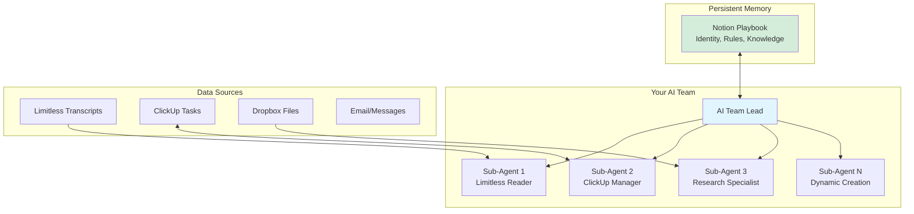
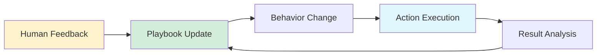

# CLI Agent as Universal Team Lead Architecture

## Core Insight

A command-line AI agent (whether Claude Code, Cursor CLI, or similar) isn't just a tool—it's the entire runtime for your AI Team Lead. By using a CLI agent as both orchestrator and executor, we eliminate complex middleware, state management, and infrastructure overhead while maintaining safety through natural boundaries.

## Architecture Overview



## Key Components

### 1. AI Team Lead via CLI Agent

Your AI Team Lead runs on a CLI agent framework and manages your AI workforce:
- **Team Orchestration**: Reads the playbook, determines what the team needs to do
- **Delegation**: Spawns specialized sub-agents for specific tasks
- **Memory Management**: Updates Notion playbook with team learnings
- **Tool Access**: Native integration with MCP servers and APIs

### 2. Sub-Agent Pattern

Each sub-agent is a fresh CLI agent process with:
- **Tailored System Prompt**: Specific to the task at hand
- **Scoped Tool Access**: Only the tools needed for that task
- **Bounded Context**: Just enough information to complete the work
- **Clean Lifecycle**: Created, executes, returns results, destroyed

Example when you say "Prepare my Project X meeting":
```bash
# AI Team Lead spawns a meeting prep sub-agent
# Pattern works with any CLI agent framework:

# Claude Code example:
claude-code --system-prompt "You are a meeting prep specialist. Extract key topics from the last 3 conversations about Project X. Format as bullet points." --tools limitless,notion

# Cursor CLI example:
cursor-cli agent --prompt "You are a meeting prep specialist. Extract key topics from the last 3 conversations about Project X. Format as bullet points." --mcp limitless,notion

# Generic pattern:
<cli-agent> <command> --system-prompt "<specialized-role>" --tools <scoped-tools>
```

### 3. Notion as Living Playbook

The Notion playbook serves as:
- **Configuration**: Identity, boundaries, permissions
- **Memory**: Accumulated knowledge and preferences
- **Policy**: Rules learned from corrections
- **Audit Trail**: Log of actions and reasoning

### 4. Self-Improvement Loop



## Sub-Agent Types & Prompts

### 1. Limitless Processor
```
You are a transcript analyst. Read the latest Limitless conversations.
Extract: commitments, decisions, preferences, deadlines.
Output: Structured JSON for playbook update.
Tools: limitless_mcp, notion_mcp
```

### 2. Task Orchestrator
```
You are a task manager. Review ClickUp for high-priority items.
Actions: Create tasks from commitments, update statuses, flag blockers.
Constraints: Never delete, always log reasoning.
Tools: clickup_mcp
```

### 3. Research Assistant
```
You are a research specialist. Given topic: [TOPIC]
Find: Latest information, key resources, expert opinions.
Format: Executive brief with sources.
Tools: web_search, dropbox_mcp
```

### 4. Playbook Updater
```
You are a knowledge curator. Review today's actions and feedback.
Update: Notion playbook with new rules, preferences, patterns.
Maintain: Version history and rationale.
Tools: notion_mcp
```

## Safety & Boundaries

### Execution Boundaries
- **Read-Heavy**: Most operations are read/analyze
- **Write-Careful**: Limited write permissions initially
- **Delete-Never**: No deletion without explicit approval
- **External-Cautious**: No external communications initially

### Error Handling
- Every error updates playbook with "lesson learned"
- Uncertain actions create approval requests
- Daily summary includes all actions taken
- Rollback mechanism via Notion version history

## Advantages Over Traditional Approaches

### vs. Fixed Automation
- **Dynamic**: Creates new capabilities as needed
- **Learning**: Improves from every interaction
- **Flexible**: Adapts to changing workflows

### vs. Monolithic AI
- **Focused**: Each sub-agent has one job
- **Safe**: Bounded context prevents overreach
- **Debuggable**: Clear trace of reasoning

### vs. Complex Infrastructure
- **Simple**: Just CLI agent + Notion
- **Portable**: Runs anywhere CLI agents run
- **Maintainable**: No custom code to debug

## Technical Requirements

### Minimum Setup
- CLI-based AI agent framework (Claude Code, Cursor CLI, or similar)
- Notion workspace with edit access
- ClickUp API access (or preferred PM tool)
- Limitless API key (or transcript source)

### Recommended Setup
- Dedicated cloud desktop for iteration
- Scheduled trigger (cron/webhook)
- Centralized credential management
- Observability (logs/metrics)

## CLI Agent Framework Options

### Claude Code
- **Strengths**: Excellent tool use, MCP native, proven reliability
- **Command Pattern**: `claude-code --system-prompt "..." --tools ...`
- **Use When**: You want stability and strong MCP integration

### Cursor CLI
- **Strengths**: Deep IDE integration, project context awareness, fast iteration
- **Command Pattern**: `cursor-cli agent --prompt "..." --mcp ...`
- **Use When**: You want tight integration with development workflows

### Framework-Agnostic Pattern
The architecture works with any CLI agent that supports:
1. Programmatic invocation with system prompts
2. Tool/MCP access specification
3. Context file passing
4. Structured output

## Getting Started

1. **Create Notion Playbook**: Define identity, tools, boundaries
2. **Test Sub-Agent Spawning**: Verify your CLI agent can invoke itself or spawn new processes
3. **Implement First Loop**: Limitless → Extract → Notion update
4. **Add ClickUp Integration**: Task creation from commitments
5. **Deploy Scheduled Run**: Every 30 minutes initially
6. **Iterate Based on Feedback**: Refine prompts and boundaries

## Implementation Patterns

### Single Agent Orchestration
```bash
# Main orchestrator runs continuously or on schedule
<cli-agent> orchestrate \
  --playbook notion://playbook-id \
  --check-transcripts \
  --update-tasks \
  --spawn-as-needed
```

### Dynamic Sub-Agent Creation
```bash
# Orchestrator spawns specialized agent
<cli-agent> spawn \
  --role "research-specialist" \
  --task "analyze-competitor-X" \
  --tools "web,dropbox" \
  --context "last-3-meetings.json" \
  --output "research-brief.md"
```

### Feedback Loop Integration
```bash
# Daily reflection and playbook update
<cli-agent> reflect \
  --playbook notion://playbook-id \
  --actions-log today \
  --extract-patterns \
  --update-rules
```

## Key Insights

- **CLI agent is the runtime**: Not just a tool, the entire execution environment
- **Notion is the knowledge base**: All memory and learning persists there
- **Sub-agents are ephemeral**: Create, execute, destroy keeps things clean
- **Conversations are training data**: Every correction becomes a rule
- **Start simple, grow complex**: Basic loops first, sophistication emerges
- **Framework flexibility**: Pattern works across different CLI agent implementations

This architecture leverages CLI-based AI agents' strengths while maintaining safety and observability. Each interaction improves capabilities, becoming more effective with use. The pattern remains consistent whether you're using Claude Code, Cursor CLI, or any future command-line agent framework.

